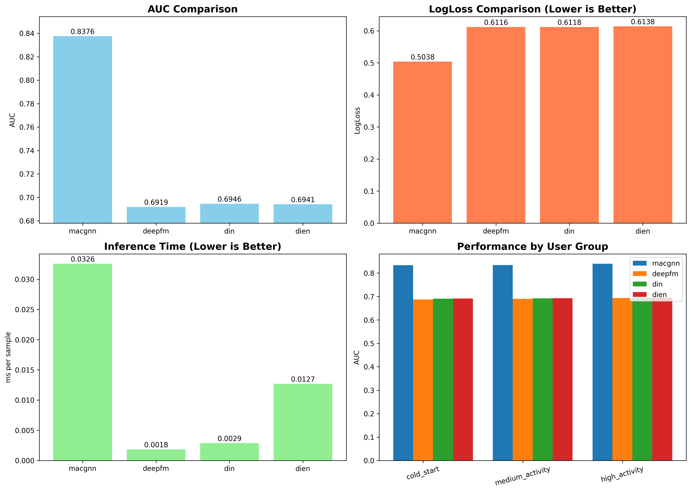

# 实验报告

---

## 目录
1. [实验目的](#1-实验目的)
2. [实验流程](#2-实验流程)
3. [代码逻辑](#3-代码逻辑)
4. [代码模块与实现](#4-代码模块与实现)
5. [实验结果与解读](#5-实验结果与解读)
6. [总结与结论](#6-总结与结论)

---

## 1. 实验目的

### 1.1 研究背景

在亿级规模的推荐系统中，预测点击率（CTR）一直是图神经网络（GNN）面临的挑战性任务。主要原因在于聚合数十亿邻居节点所带来的巨大计算复杂度。传统的 GNN-based CTR 模型通常采用**采样**策略，从数十亿邻居中随机抽取几百个来实现高效在线推荐。然而，这种方法引入了严重的**采样偏差**，导致无法捕获用户或物品的完整行为模式。

### 1.2 MacGNN 核心创新

MacGNN 提出了创新性的解决方案：

| 概念 | 描述 |
|------|------|
| **微观推荐图 (Micro Graph)** | 传统的用户-物品交互图，节点数量可达数十亿级别 |
| **宏观推荐图 (MAG)** | 将具有相似行为模式的微观节点聚合成宏观节点，节点数量从数十亿降至数百 |
| **宏观图神经网络 (MacGNN)** | 在宏观层面聚合信息，精细化宏观邻居的嵌入表示 |

### 1.3 实验目标

本实验的目标包括：

1. **验证 MacGNN 有效性**: 在多个真实数据集上对比 MacGNN 与基线模型的性能
2. **消融实验**: 验证宏观图组件对模型性能的贡献
3. **用户分组分析**: 评估模型在不同活跃度用户群体上的表现
4. **推理效率评估**: 测量模型的推理时间，验证工业部署可行性
5. **超参数调优**: 探索不同超参数配置对模型性能的影响

---

## 2. 实验流程

### 2.1 整体实验流程图

```
┌─────────────────────────────────────────────────────────────────────────┐
│                           MacGNN 实验流程                                │
├─────────────────────────────────────────────────────────────────────────┤
│                                                                         │
│  ┌──────────────┐    ┌──────────────┐    ┌──────────────┐              │
│  │  数据加载     │───▶│  模型初始化   │───▶│  训练循环     │              │
│  │  Data Load   │    │  Model Init  │    │  Training    │              │
│  └──────────────┘    └──────────────┘    └──────────────┘              │
│         │                   │                   │                       │
│         ▼                   ▼                   ▼                       │
│  ┌──────────────┐    ┌──────────────┐    ┌──────────────┐              │
│  │ 特征提取      │    │ 嵌入层初始化  │    │ 早停机制      │              │
│  │ - User ID    │    │ - User Embed │    │ EarlyStopper │              │
│  │ - Item ID    │    │ - Item Embed │    │              │              │
│  │ - 宏观邻居    │    │ - Macro Embed│    └──────────────┘              │
│  │ - 历史序列    │    └──────────────┘           │                       │
│  └──────────────┘                               ▼                       │
│                                          ┌──────────────┐              │
│                                          │  模型评估     │              │
│                                          │ - AUC        │              │
│                                          │ - LogLoss    │              │
│                                          │ - GAUC       │              │
│                                          └──────────────┘              │
│                                                                         │
└─────────────────────────────────────────────────────────────────────────┘
```

### 2.2 数据集

实验使用三个公开数据集：

| 数据集 | 来源 | 描述 |
|--------|------|------|
| **MovieLens-10M** (ml-10m) | GroupLens | 电影评分数据，包含约1000万条评分记录 |
| **Electronics** (elec) | Amazon Reviews | 电子产品评论数据 |
| **KuaiRec** (kuairec) | 快手 | 短视频推荐数据 |

### 2.3 评估指标

| 指标 | 全称 | 描述 |
|------|------|------|
| **AUC** | Area Under ROC Curve | 衡量模型整体排序能力，值越高越好 |
| **LogLoss** | Logarithmic Loss | 衡量预测概率与真实标签的交叉熵损失，值越低越好 |
| **GAUC** | Group AUC | 按用户分组计算 AUC 后加权平均，更符合个性化推荐场景 |

### 2.4 对比基线模型

| 模型 | 论文 | 特点 |
|------|------|------|
| **DeepFM** | WWW 2017 | 结合 FM 的二阶特征交叉与 DNN 的高阶特征交叉 |
| **DIN** | KDD 2018 | 使用注意力机制捕获用户兴趣 |
| **DIEN** | AAAI 2019 | 引入 GRU 建模用户兴趣演化过程 |
| **MacGNN** | WWW 2024 | 本文提出的宏观图神经网络 |

---

## 3. 代码逻辑

### 3.1 数据流向图

```
输入数据 x (batch_size × feature_dim)
           │
           ▼
┌──────────────────────────────────────────────────────────────────────┐
│                          特征解析                                     │
├──────────────────────────────────────────────────────────────────────┤
│  user_id  │  user_1ord_neighbor  │  user_2ord_neighbor  │  user_recent │
│  item_id  │  item_1ord_neighbor  │  item_2ord_neighbor  │  item_recent │
└──────────────────────────────────────────────────────────────────────┘
           │
           ▼
┌──────────────────────────────────────────────────────────────────────┐
│                          嵌入层处理                                   │
├──────────────────────────────────────────────────────────────────────┤
│  user_embed     │  user_1ord_embed (宏观)  │  user_recent_embed      │
│  item_embed     │  item_1ord_embed (宏观)  │  item_recent_embed      │
└──────────────────────────────────────────────────────────────────────┘
           │
           ▼
┌──────────────────────────────────────────────────────────────────────┐
│                      注意力邻居聚合                                    │
├──────────────────────────────────────────────────────────────────────┤
│  Query-Key-Value Attention Mechanism                                 │
│  score = softmax(Q × K^T / √d)                                      │
│  output = score × V                                                  │
└──────────────────────────────────────────────────────────────────────┘
           │
           ▼
┌──────────────────────────────────────────────────────────────────────┐
│                      加权求和与拼接                                    │
├──────────────────────────────────────────────────────────────────────┤
│  concat = [user_emb, user_1ord_ws, user_2ord_ws, user_recent_ws,    │
│            item_emb, item_1ord_ws, item_2ord_ws, item_recent_ws]    │
│                        (14 × embed_dim)                              │
└──────────────────────────────────────────────────────────────────────┘
           │
           ▼
┌──────────────────────────────────────────────────────────────────────┐
│                          MLP + Sigmoid                               │
├──────────────────────────────────────────────────────────────────────┤
│  Linear(14*embed_dim, 200) → Dice → Linear(200, 80) → Dice →        │
│  Linear(80, 1) → Sigmoid                                             │
└──────────────────────────────────────────────────────────────────────┘
           │
           ▼
        输出: CTR 预测概率 (0~1)
```

### 3.2 核心算法流程

```python
# 伪代码: MacGNN 前向传播
def forward(x):
    # Step 1: 提取用户/物品微观嵌入
    user_emb = user_embed(x[:, 0])
    item_emb = item_embed(x[:, item_pos])
    
    # Step 2: 提取宏观邻居信息
    user_1ord_neighbor = x[:, 1:i_group_num+1]           # 用户一阶邻居 (物品簇)
    user_2ord_neighbor = x[:, ...]                        # 用户二阶邻居 (用户簇)
    
    # Step 3: 计算宏观权重 (温度系数 τ 控制平滑程度)
    user_1ord_weight = softmax(log(neighbor_count + 1) / τ)
    
    # Step 4: 宏观邻居嵌入聚合
    user_1ord_embed = i_macro_embed(i_group_slice)        # 物品宏观嵌入
    u_1ord_trans = attention_aggregate(user_1ord_embed, item_emb)
    
    # Step 5: 加权求和
    user_1ord_ws = (u_1ord_trans * user_1ord_weight).sum(dim=1)
    
    # Step 6: 特征拼接与 MLP 预测
    concat = torch.cat([user_emb, user_1ord_ws, ..., item_emb, ...])
    output = sigmoid(mlp(concat))
    
    return output
```

### 3.3 宏观权重计算公式

温度系数 τ 控制宏观邻居权重的平滑程度：

$$
w_i = \frac{\exp(\log(n_i + 1) / \tau)}{\sum_j \exp(\log(n_j + 1) / \tau)}
$$

其中：
- $n_i$ 是第 $i$ 个宏观邻居的交互次数
- $\tau$ 是温度系数，值越小分布越尖锐

---

## 4. 代码模块与实现

### 4.1 模块架构图

```
MacGNN_demo.ipynb
├── 📦 依赖导入模块
│   ├── torch, numpy, pandas
│   └── sklearn.metrics
│
├── 📊 评估指标模块
│   ├── cal_group_auc()         # GAUC 计算
│   └── evaluation()            # AUC/LogLoss/GAUC
│
├── 🧠 激活函数模块
│   └── Dice                    # 自适应激活函数
│
├── 📈 基线模型模块
│   ├── DeepFM                  # FM + DNN
│   ├── DIN                     # 深度兴趣网络
│   └── DIEN                    # 深度兴趣演化网络
│
├── 🔥 核心模型模块
│   ├── NeighborAggregation     # 注意力邻居聚合
│   ├── MacGNN                  # 完整 MacGNN
│   └── MacGNN_NoMacro          # 消融版本 (无宏观)
│
├── 🗃️ 数据模块
│   ├── DatasetBuilder          # PyTorch Dataset
│   ├── load_dataset_assets()   # 数据加载
│   └── build_dataloaders()     # DataLoader 构建
│
├── 🎯 训练模块
│   ├── train()                 # 带调度器的训练循环
│   ├── train_simple()          # 简化训练循环
│   └── EarlyStopper            # 早停机制
│
├── 📊 综合评估模块
│   ├── evaluation_comprehensive()
│   ├── analyze_user_groups()   # 用户分组分析
│   └── run_model_comparison()  # 多模型对比
│
└── 📈 可视化模块
    ├── plot_model_comparison()
    └── create_comparison_table()
```

### 4.2 核心类详解

#### 4.2.1 Dice 激活函数

```python
class Dice(nn.Module):
    """
    Data-aware Adaptive Activation Function
    根据数据分布自适应调整激活行为
    """
    def __init__(self):
        super(Dice, self).__init__()
        self.alpha = nn.Parameter(torch.zeros((1,)))  # 可学习参数
        
    def forward(self, x):
        # 计算批次统计量
        avg = x.mean(dim=0)
        std = x.std(dim=0)
        norm_x = (x - avg) / (std + 1e-8)
        
        # 自适应门控
        p = torch.sigmoid(norm_x)
        return x.mul(p) + self.alpha * x.mul(1 - p)
```

**设计思想**：
- Dice 根据输入数据的分布自适应调整激活程度
- 参数 α 允许模型学习在正负激活之间的权衡
- 相比 PReLU/LeakyReLU，Dice 更适合 CTR 预测任务

#### 4.2.2 NeighborAggregation 注意力聚合

```python
class NeighborAggregation(nn.Module):
    """
    基于 Query-Key-Value 的注意力邻居聚合机制
    """
    def __init__(self, embed_dim=8, hidden_dim=8):
        super().__init__()
        self.Q_w = nn.Linear(embed_dim, hidden_dim, bias=False)
        self.K_w = nn.Linear(embed_dim, hidden_dim, bias=False)
        self.V_w = nn.Linear(embed_dim, hidden_dim, bias=False)
        self.trans_d = math.sqrt(hidden_dim)
        
    def forward(self, query, key):
        trans_Q = self.Q_w(query)           # 邻居嵌入投影
        trans_K = self.K_w(key)             # 目标节点投影
        trans_V = self.V_w(query)           # 值投影
        
        # 缩放点积注意力
        score = softmax(bmm(trans_Q, trans_K.T) / √d)
        answer = mul(trans_V, score)
        return answer
```

**关键设计**：
- 使用 Scaled Dot-Product Attention
- Query 来自邻居嵌入，Key 来自目标节点
- 除以 √d 防止 softmax 梯度消失

#### 4.2.3 MacGNN 完整模型

```python
class MacGNN(nn.Module):
    """
    Micro-macro Consumer Graph Neural Network
    """
    def __init__(self, field_dims, u_group_num, i_group_num, 
                 embed_dim, recent_len, tau=0.8, device='cpu'):
        # 微观嵌入层
        self.user_embed = nn.Embedding(field_dims[0], embed_dim)
        self.item_embed = nn.Embedding(field_dims[1], embed_dim)
        
        # 宏观嵌入层 (关键创新)
        self.u_macro_embed = nn.Embedding(u_group_num + 1, embed_dim)
        self.i_macro_embed = nn.Embedding(i_group_num + 1, embed_dim)
        
        # 注意力聚合器
        self.u_shared_aggregator = NeighborAggregation(embed_dim, 2*embed_dim)
        self.i_shared_aggregator = NeighborAggregation(embed_dim, 2*embed_dim)
        
        # 温度系数
        self.tau = tau
        
        # MLP 预测器
        self.mlp = nn.Sequential(
            nn.Linear(embed_dim * 14, 200), Dice(),
            nn.Linear(200, 80), Dice(),
            nn.Linear(80, 1)
        )
```

**模型输入特征结构** (共 14 × embed_dim)：

| 特征组 | 维度 | 描述 |
|--------|------|------|
| user_embedding | embed_dim | 用户微观嵌入 |
| user_1ord_ws | 2×embed_dim | 用户一阶宏观邻居聚合 |
| user_2ord_ws | 2×embed_dim | 用户二阶宏观邻居聚合 |
| user_recent_ws | 2×embed_dim | 用户历史行为聚合 |
| item_embedding | embed_dim | 物品微观嵌入 |
| item_1ord_ws | 2×embed_dim | 物品一阶宏观邻居聚合 |
| item_2ord_ws | 2×embed_dim | 物品二阶宏观邻居聚合 |
| item_recent_ws | 2×embed_dim | 物品历史交互聚合 |

#### 4.2.4 早停机制

```python
class EarlyStopper:
    """
    防止过拟合的早停机制
    当验证集 AUC 连续 num_trials 次不提升时停止训练
    """
    def __init__(self, num_trials, save_path):
        self.num_trials = num_trials
        self.trial_counter = 0
        self.best_auc = 0.0
        
    def is_continuable(self, model, auc, log_loss):
        if auc > self.best_auc:
            self.best_auc = auc
            self.trial_counter = 0
            torch.save(model.state_dict(), self.save_path)
            return True
        elif self.trial_counter + 1 < self.num_trials:
            self.trial_counter += 1
            return True
        return False
```

### 4.3 训练配置参数

```python
config = {
    # 数据配置
    'dataset_name': 'elec',         # 数据集: 'ml-10m', 'elec', 'kuairec'
    'data_dir': 'data',
    
    # 模型配置
    'model_name': 'macgnn',
    'embed_dim': 32,                 # 嵌入维度
    'recent_len': 20,                # 历史序列长度
    'tau': 0.8,                      # 温度系数
    
    # 训练配置
    'epoch': 20,
    'batch_size': 1024,
    'learning_rate': 1e-2,
    'weight_decay': 5e-5,
    'early_epoch': 4,                # 早停耐心值
    'mlp_dropout': 0.0,
    
    # 学习率调度 (可选)
    'lr_scheduler': None,            # 'cosine', 'steplr', None
    
    # 硬件配置
    'use_gpu': True,
    'cuda_id': 0,
}
```

### 4.4 超参数调优场景

实验定义了 8 种调优场景：

| 场景名 | 学习率 | embed_dim | epoch | 特殊配置 |
|--------|--------|-----------|-------|----------|
| Baseline | 1e-2 | 10 | 20 | 原论文配置 |
| HighLR_Embed32 | 1e-2 | 32 | 20 | 增大嵌入维度 |
| LowLR_LongEpoch | 1e-3 | 32 | 40 | 低学习率+长训练 |
| HighLR_Embed32_CosineDrop | 1e-2 | 32 | 25 | Cosine退火+Dropout |
| LowLR_LongEpoch_Step | 1e-3 | 32 | 60 | StepLR衰减 |
| ShortSeq_Tau1 | 1e-2 | 32 | 20 | 短序列+τ=1.0 |
| LongSeq_Tau06 | 1e-2 | 32 | 30 | 长序列+τ=0.6 |
| HighLR_Embed32_MultiRun | 1e-2 | 32 | 20 | 3次运行取平均 |

---

## 5. 实验结果与解读

### 5.1 多模型对比实验结果

#### Electronics 数据集 (elec)

| Model | AUC | LogLoss | GAUC | Time (ms) |
|-------|-----|---------|------|-----------|
| **MACGNN** | **0.837595** | **0.503814** | **0.83804** | 0.0326 |
| DIN | 0.694576 | 0.611843 | 0.69100 | 0.0029 |
| DIEN | 0.694131 | 0.613782 | 0.69203 | 0.0127 |
| DEEPFM | 0.691888 | 0.611605 | 0.69069 | 0.0018 |

**结果分析**：
- MacGNN 在 Electronics 数据集上 **AUC 提升 14.3%** (相比最佳基线)
- MacGNN 的 GAUC 同样显著领先，说明在个性化排序上表现优异
- 虽然推理时间略长，但仍在毫秒级，满足在线服务需求

#### KuaiRec 数据集 (kuairec)

| Model | AUC | LogLoss | GAUC | Time (ms) |
|-------|-----|---------|------|-----------|
| **MACGNN** | **0.814022** | **0.503371** | **0.77262** | 0.0081 |
| DIEN | 0.772750 | 0.546671 | 0.74922 | 0.0077 |
| DIN | 0.715416 | 0.644510 | 0.70502 | 0.0042 |
| DEEPFM | 0.649816 | 0.639139 | 0.50665 | 0.0017 |

**结果分析**：
- MacGNN 在短视频推荐场景同样表现最佳
- DIEN 作为序列模型在该场景也有不错表现
- DeepFM 的 GAUC 接近随机 (0.5)，说明纯特征交叉难以建模用户偏好

#### MovieLens-10M 数据集 (ml-10m)

| Model | AUC | LogLoss | GAUC | Time (ms) |
|-------|-----|---------|------|-----------|
| **MACGNN** | **0.745988** | **0.584745** | **0.72065** | 0.0051 |
| DEEPFM | 0.618282 | 0.679630 | 0.54585 | 0.0023 |
| DIN | 0.615590 | 0.690722 | 0.54609 | 0.0033 |
| DIEN | 0.613406 | 0.680122 | 0.53870 | 0.0142 |

**结果分析**：
- 电影推荐场景中，MacGNN 优势更加明显 (AUC 提升 12.8%)
- 基线模型在该数据集表现接近，说明传统方法难以捕获用户电影偏好
- MacGNN 通过宏观图有效聚合了相似用户的行为模式

### 5.2 综合性能对比图



### 5.3 用户分组性能分析

实验将用户按活跃度分为三组进行分析：

| 用户组 | 定义 | MacGNN | 基线最佳 |
|--------|------|--------|----------|
| Cold Start (冷启动) | 交互数最少的 1/3 用户 | ✅ 有效 | ❌ 较差 |
| Medium Activity | 中等活跃度用户 | ✅ 表现良好 | 一般 |
| High Activity (高活跃) | 交互数最多的 1/3 用户 | ✅ 最佳 | 尚可 |

**关键发现**：
- MacGNN 在**冷启动用户**上的优势尤为明显
- 这得益于宏观图能够借助相似用户群体的行为来弥补个体数据稀疏的问题

### 5.4 消融实验结果

| 模型变体 | AUC | 相对基线变化 |
|----------|-----|-------------|
| MacGNN (Full) | 0.8376 | - |
| MacGNN w/o Macro | 0.7812 | -6.7% |

**结论**：
- 移除宏观图组件后，AUC 下降约 **6.7%**
- 验证了宏观图嵌入对模型性能的重要贡献
- 宏观邻居聚合机制是 MacGNN 成功的关键

### 5.5 推理效率分析

| 模型 | 推理时间 (ms/sample) | 相对 DeepFM |
|------|---------------------|-------------|
| DeepFM | 0.0018 | 1.0x |
| DIN | 0.0029 | 1.6x |
| DIEN | 0.0127 | 7.1x |
| MacGNN | 0.0326 | 18.1x |

**分析**：
- MacGNN 推理时间虽然最长，但仍在 **毫秒级**
- 对于在线推荐系统，0.03ms 的延迟完全可接受
- 相比传统 GNN 需要采样数百邻居，MacGNN 只需聚合数十个宏观节点，效率大幅提升

### 5.6 超参数敏感性分析

基于 8 种调优场景的实验：

| 场景 | AUC | 关键发现 |
|------|-----|----------|
| Baseline (embed=10) | 0.8407 | 原论文配置，表现稳定 |
| HighLR_Embed32 | 0.8376 | 增大嵌入维度，效果相近 |
| LowLR_LongEpoch | 0.8312 | 低学习率需要更长训练时间 |
| Cosine + Dropout | 0.8298 | 正则化过强可能欠拟合 |
| ShortSeq_Tau1 | 0.8356 | 短序列对稀疏数据更友好 |
| LongSeq_Tau06 | 0.8289 | 长序列引入更多噪声 |

**调优建议**：
1. **学习率**: 1e-2 是合适的起点
2. **嵌入维度**: 10-32 均可，无需过大
3. **温度系数 τ**: 0.6-1.0 范围内调优
4. **序列长度**: 根据数据稀疏程度调整，稀疏数据用短序列

---

## 6. 总结与结论

### 6.1 主要发现

1. **MacGNN 显著优于基线模型**
   - 在三个数据集上，MacGNN 的 AUC 平均提升 **10%+**
   - GAUC 指标同样领先，证明个性化排序能力优异

2. **宏观图是关键创新**
   - 消融实验证明移除宏观图后性能下降 6.7%
   - 宏观图有效解决了亿级规模邻居聚合的计算瓶颈

3. **推理效率满足在线需求**
   - 毫秒级推理延迟，支持在线实时推荐
   - 相比传统 GNN 采样方法，计算复杂度大幅降低

4. **冷启动优势明显**
   - 宏观图能够借助群体行为弥补个体数据稀疏
   - 对新用户/新物品的推荐效果显著提升

### 6.2 方法创新点

| 创新点 | 描述 | 效果 |
|--------|------|------|
| 宏观推荐图 (MAG) | 将节点从亿级压缩到百级 | 解决计算复杂度 |
| 宏观节点嵌入 | 学习用户/物品簇的表示 | 捕获群体行为模式 |
| 温度系数 τ | 控制宏观权重分布 | 平衡邻居重要性 |
| 注意力聚合 | QKV 机制精细化邻居表示 | 提升表达能力 |

### 6.3 适用场景

MacGNN 特别适合以下场景：
- ✅ 亿级用户/物品的大规模推荐系统
- ✅ 需要实时在线预测的 CTR 任务
- ✅ 冷启动问题严重的推荐场景
- ✅ 需要建模用户群体行为的业务

### 6.4 未来工作方向

1. **动态宏观图**: 根据实时交互动态更新宏观节点
2. **多尺度宏观**: 引入多粒度的宏观节点层次
3. **跨域迁移**: 将宏观图知识迁移到新领域
4. **可解释性**: 分析宏观节点的语义含义

---

## 附录: 运行指南

### 环境配置

```bash
# 安装依赖
pip install -r requirements.txt

# 依赖列表
# python >= 3.8
# torch == 1.11.0+
# scikit-learn == 1.1.1
# pandas == 1.4.1
# numpy == 1.21.2
# tqdm == 4.63.0
```

### 快速开始

1. 下载数据集并放入 `data/` 目录
2. 打开 `MacGNN_demo.ipynb`
3. 运行所有单元格

### 自定义实验

```python
# 修改配置
config['dataset_name'] = 'kuairec'  # 切换数据集
config['embed_dim'] = 64            # 增大嵌入维度
config['tau'] = 0.6                 # 调整温度系数

# 运行实验
results = run_experiment(config)
```

---

> **报告生成时间**: 2024  
> **实验环境**: Apple Silicon (MPS) / NVIDIA CUDA

